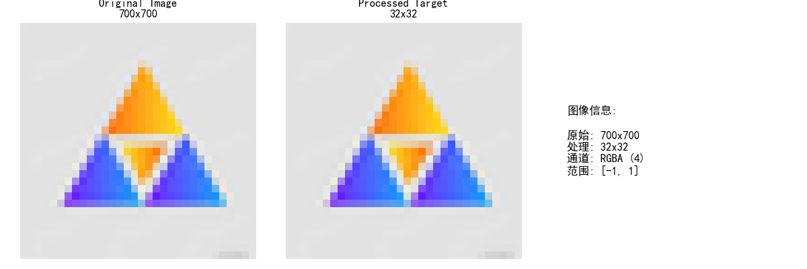

## Neural-Cellular-Automata

# 文件夹展示我关于NCA制作与设计的若干次阶段性成果（持续更新中）
# The folder shows my NCA attemptation with the phased objectives（continuously updated）

# 可微分神经元胞自动机（NCA）图像生成
# Differentiable Neural Cellular Automata for Image Generation

**基于PyTorch实现的可微分神经元胞自动机模型。支持任意尺寸图像的RGBA四通道编码与演化，能从中心种子生长到目标图像。**  
*A differentiable Neural Cellular Automata (NCA) model implemented with PyTorch. Supports RGBA four-channel encoding and evolution for images of arbitrary sizes, enabling growth from a central seed to target images.*

## 文件说明 | File Description

- **`image_1st_upload.py`**  
  **主训练脚本，包含混合精度训练、CUDA流异步传输等优化，支持单张图片输入训练，实现简单规则图形生成。**  
  *Main training script with mixed precision training and CUDA stream async transfer optimizations. Supports single-image input training for generating simple pattern formations.*

- **`best_perform_test.py`**  
  **测试和演示脚本，用于快速验证模型结构，不含图像上传功能。**  
  *Testing and demonstration script for rapid model architecture validation. Does not include image upload functionality.*

  ## 📊 效果展示 | Results Gallery

### 第一个生成成果 (First Successful Generation)

这是本项目的第一个效果比较好的生成结果，记录了NCA模型从中心种子生长到目标图像的过程。

**训练参数**：
- 图像尺寸：32×32
- 训练轮次：3000
- 学习率：0.5

**输入图像**：


**生成结果**：


**损失曲线**（如果有）：
![loss](results/first_generation/training_loss.png


## 环境要求 | Requirements
- Python 3.7+
- PyTorch 1.9+
- 依赖包：numpy, matplotlib, imageio, tqdm  
  *Dependencies: numpy, matplotlib, imageio, tqdm*

安装依赖：
```bash
pip install torch numpy matplotlib imageio tqdm
