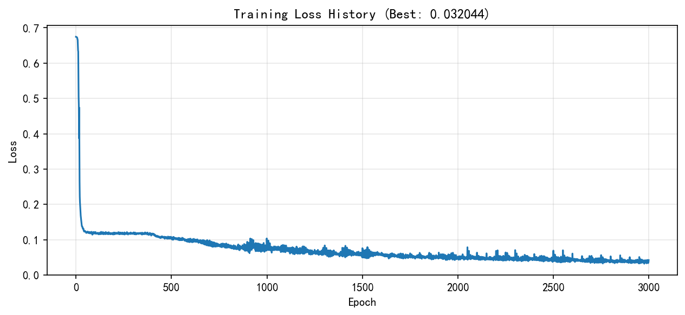

# First Generation Results
## 🏆 里程碑成果：第一个成功生成
## 🏆 Milestone Achievement: First Successful Generation

这是本项目第一个效果较好的生成结果，标志着模型成功从中心种子学习到目标图像的特征。

*This is the first promising result of this project, marking the model's ability to successfully learn target image features from a central seed.*

### 🔧 实验配置 | Experiment Configuration
| 参数 （ parameter ） | 取值 （ value ） |
|:---|:---|
| 图像尺寸 （ image size ） | 32 × 32 像素 （ pixels ） |
| 训练轮次 （ training steps ） | 3000 |
| 学习率 （ learning rate ） | 0.5 |
| 模型通道数 （ channels ） | 16 |
| 更新概率 （ update rate ） | 0.5 |
| 训练时间 （ training date ） | 2026-03-19 |

### 📸 生成效果对比 | Generation Results

| 输入图像 （ input ） | 生成结果 （ output ） | 损失曲线 （ loss curve ） |
|:---:|:---:|:---:|
|  |  |  |

**图注**：NCA模型从中心种子生长到目标图像的完整过程（32×32像素，3000轮训练）
*Caption: Complete growth process of the NCA model from a central seed to the target image (32×32 pixels, 3000 training steps)*

加载播放失败可尝试刷新界面。

*If the animation fails to load or play, please refresh the page and try again.*
